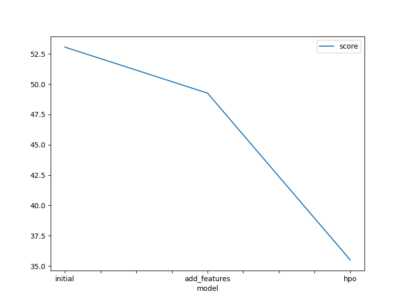
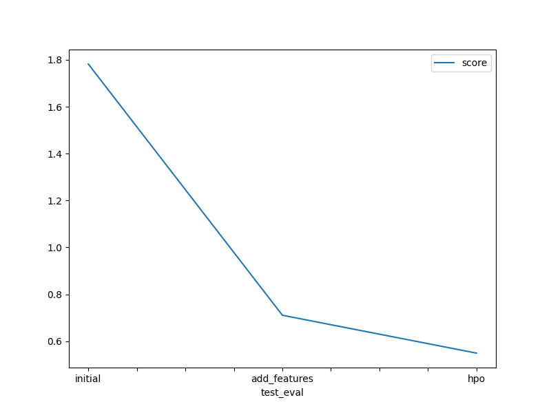

# Report: Predict Bike Sharing Demand with AutoGluon Solution
#### Ivan Perfilyev

## Initial Training
### What did you realize when you tried to submit your predictions? What changes were needed to the output of the predictor to submit your results?
By far the toughest part was to install Python locally, install Jupyter Lab with all packages, and download the datasets from Kaggle. The training dataset had two additional variables 'casual' and 'registered' that I had to drop. In order to make predictions you actually need an identical test and train dataset, so when changes are made to the train, for example new features added - you have to do the same thing for test. Once you changed the dataset there is no going back to re-run the original model, so if you want to rerun the first iteration of the model without features and hyperparameters - you need to restart the whole project. Sometimes predictions generate negative numbers which you have to drop but for me it only produced them in the last model iteration. 

Also, once you have submitted to Kallge I don't think you can undo your submission and if you then rerun the model there is no way to see what you have submitted originally compared to the updated results. So, the results in the final file end up different from the submission unless you run everything in just one go.
 

### What was the top ranked model that performed?
My best model was a WeightedEnsemble_L2 with new features and hyperparameters: the score value of 35.504541 (the Kaggle score of 0.54933)     

## Exploratory data analysis and feature creation
### What did the exploratory analysis find and how did you add additional features?
The temperature, air temperature, and humidity seem to be normally distributed, while the windspeed and the response variable (count) are both strongly skewed to the right. Holidays and workdays are both binary, so the distribution for them is not meaningful. The date-time variable is not very impactful on its own but splitting it into days, moths, and hours adds important granularity to the data that indicates bike-sharing patterns for certain days and hours of the day.

### How much better did your model preform after adding additional features and why do you think that is?
Adding additional features resulted in a massive (~69%) model improvement. Apparently, a more granular breakdown of the timestamp, such is day of the month and time of the day, offers much stronger predictive power compared to a combined date.

## Hyper parameter tuning
The model improved by about 22%. The improvement is not as significant as after adding new features but definitely noticeable. 

### If you were given more time with this dataset, where do you think you would spend more time?
I would further tweak hyperparameters - as the model with hyperparameters seems to perform the best. Maybe I would use some type of automatic parameter search. Another option would be to allow Autogluon to run for a longer period of time.

### Create a table with the models you ran, the hyperparameters modified, and the kaggle score.
|model|hpo1|hpo2|hpo3|score|
|--|--|--|--|--|
|initial|default|defaul|default|1.78224|
|add_features|default|defaul|default| 0.71084|
|hpo|num_trials: 50, searcher: auto, scheduler: local,time_limit=600|same tune_kwargs + {GBM, NN_TORCH} with options |same tune_kwargs + {GBM, NN_TORCH, CAT, RF, XT} with options |0.54933|

### Create a line plot showing the top model score for the three (or more) training runs during the project.

### Create a line plot showing the top kaggle score for the three (or more) prediction submissions during the project.

## Summary
The goal of this project was to analyze and predict bike sharing demand based on various independent indicators such as weather conditions, calendar date, time of the day etc.  For this purpose, we used the available bike sharing data with a count response, split it into train and test datasets, and trained the model to predict the bike sharing counts using the Autogluon models. The models were run in 3 iterations: a base model, a model with added features, and a hyperparametarized model. The HPO model performed the best with some minor fluctuations based on the changes in hyperparameters. However, the biggest improvement in the predictive power of the model resulted in splitting the date-time indicator into separate, more granular segments (moths, days, hours). Overall, the project results indicated that the same model can produce much more robust predictive outcomes when proper feature engineering and hyperparametarization are introduced to the process.   

